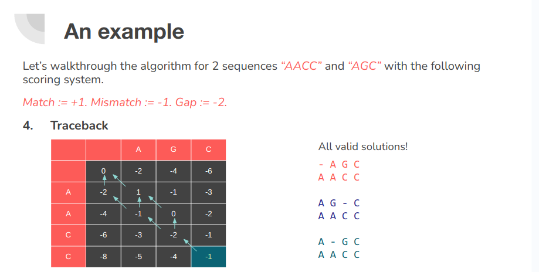
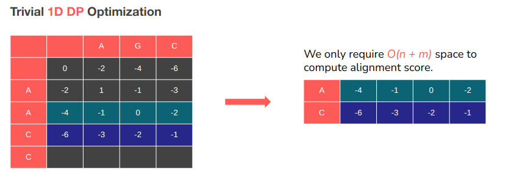
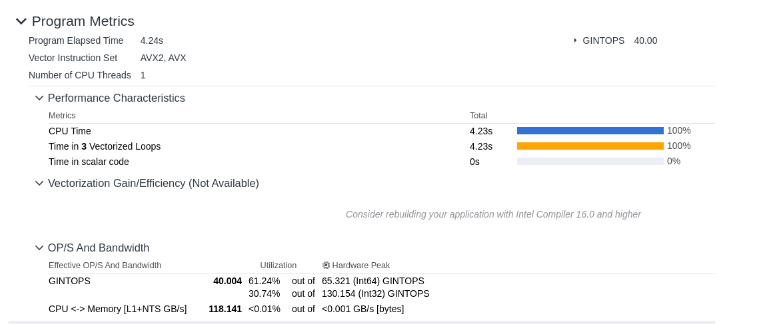

# Needleman-Wunsch Algorithm Optimization
### Team
- A Kishore Kumar
- Vidit Jain

## Description
This project involves optimizing a dynamic programming algorithm that cannot be parallelized trivially.

In this project, we worked on reordering the way we process the recurrence relation by iterating over the diagonals instead of a row-wise or column-wise method, and stored only the diagonals needed for computing the future values to save space. Doing so allowed us to make the algorithm parallelizable by removing inter-dependencies.

We also modified the way we stored these diagonals by storing them in a linear fashion instead of accessing the elements as a diagonal of a grid, making the array access much more cache-efficient.

This optimizations provided a `100x` speedup with no loss of accuracy, while only taking up `O(n)` space. The catch? We lose access to backtracking information. But in the future work we plan on combining the current work with the Hierschberg algorithm to restore access to this information while still having massive speedup.

## Context
Pairwise sequence alignment is a way of arranging protein (or DNA) sequences to identify regions of similarity that may be a consequence of evolutionary relationships between the sequences. 
[Encyclopedia of Bioinformatics and Computational Biology, 2019](https://www.sciencedirect.com/topics/biochemistry-genetics-and-molecular-biology/sequence-alignment)
There are two types of sequence alignment. Global and Local. 
Calculating a global alignment is a form of global optimization that "forces" the alignment to span the entire length of all query sequences. By contrast, local alignments identify regions of similarity within long sequences that are often widely divergent overall. [Wikipedia - Sequence alignment](https://en.wikipedia.org/wiki/Sequence_alignment)

## Scoring system
There are three primary components of alignment: 
1. Matches
2. Mis-matches
3. Gaps
Each of these options are given some penalty or score. We then use these scores to compute the final score of alignment. 

## The DP Solution
The Needleman-Wunsch algorithm uses dynamic programming (DP) to solve the global alignment problem optimally in `O(nm)` space and time complexity where n and m are the lengths of the two sequences we are trying to pairwise align. 
Formally, let us define `F(n, m)` as a function that computes the global alignment score between two sequences `A` and `B`. This function can then be recursively defined as follows. 

```
F(0, 0) = 0
F(i, 0) = F(i - 1, 0) - d
F(0, j) = F(0, j - 1) - d

F(i, j) = max { F(i - 1, j) - d, 
  				F(i, j - 1) - d, 
  				F(i - 1, j - 1) + s(A_i, B_i) }
```



## Optimization

### Benchmark environment

[Google Micro-Benchmark Library](https://github.com/google/benchmark)

One function run includes both reading files into memory and computing global alignment score.
```
Hardware: Ryzen 7 5800H (8c/16t @3.2GHz Base). 512KB / 4MB / 16MB Cache. 16GB RAM.

Test case information:
small/test_1/1.fasta → 10035bp small/test_1/2.fasta → 10200bp		Order 1e4
small/test_2/1.fasta → 57474bp small/test_2/2.fasta → 56574bp		Order 5e4
small/test_3/1.fasta → 162114bp small/test_3/2.fasta → 171823bp	Order 1e5
small/test_4/1.fasta → 542868bp small/test_4/2.fasta → 536165bp	Order 5e5
medium/1.fasta → 3147090bp medium/2.fasta → 3282708bp		Order 3e6
```

### Benchmark conditions

- All benchmarks were run when CPU was idling at < 3% utilization across all cores as monitored by htop. 
- Idling RAM usage was < 800MB. 
- Caches were flushed before running the benchmarks.
- CPU Governor frequency was set to performance for more consistent results.
- Compiler (g++) flags: `-O3 -ffast-math -mavx2 -march=native -fopenmp`

### Needleman-Wunsch requires `O(nm)` space to run.

We’re often working with sequences that are of the magnitude 1e6 or even 1e9.
Example: Human genome, size: 3,117,275,501 bp Wikipedia - Human Genome
```
1e6 ✕ 1e6 = 1e12 or ~1TB memory
1e6 ✕ 1e9 = 1e15 or ~1000TB memory
1e9 ✕ 1e9 = 1e18 or ~1 ExaByte memory!
```

#### Reduce the scope
Needleman-Wunsch requires O(nm) space to run… if we wish to also obtain the optimal alignment.


### Results!
```
------------------------------------------------------------------------
Benchmark                          	Time         	CPU   Iterations
------------------------------------------------------------------------
needle2d_small_1_bench          167 ms      	167 ms        	4
needle2d_small_2_bench          4996 ms     	4993 ms        	1
needle1d_small_1_bench          86.9 ms     	86.9 ms        	8
needle1d_small_2_bench          2740 ms     	2739 ms        	1
needle1d_small_3_bench         	23668 ms    	23659 ms       	1
needle1d_small_4_bench 			257098 ms   	256949 ms      	1
```
1. small/1 : 41.75ms / iter to 10.8625ms / iter (~4x speedup)
2. small/2 : 4996ms to 2740ms (~2x speedup)
3. small/3 : runs!
4. small/4 : runs!

### Is parallelization possible?
Dependence on `(i - 1, j)` means we cannot vectorize over columns.
Dependence on `(i, j - 1)` means we cannot vectorize over rows.
Also dependent on `(i - 1, j - 1)`

What to do?

### The polytope method
Let’s highlight the cells that have their dependencies satisfied and compute these cells in every iteration. This is essentially the dependency graph of our DP table. 
It is parallelizable along the anti-diagonal. 


### Memory accesses
The memory access pattern is terrible. Hard for pre-fetcher to learn pattern.
Even if we can pre-fetch, terrible for spatial locality.
Use blocking?
Block the DP table into small chunks which individually fit in cache and compute the blocks along the anti-diagonal.
> Cumbersome implementation. Will still have `B` cache misses per block for block size `B`. Cannot vectorize. 

### An alternate solution
Restructure the DP table in memory so the wave-front is linearly stored in memory
Great memory access pattern. Good spatial locality.
Easy to implement 1D DP version with this structure → Good temporal locality.


#### Possible to vectorize?
```
__m128i _mm_cmpistrm (__m128i a, __m128i b, const int imm8)
```
Capable of performing bytewise character match and returning a mask. Slow instruction. Need to test.

### Auto-Vectorized!


### Benchmark results
```
------------------------------------------------------------------------
Benchmark                          	Time         	CPU   		Iterations
------------------------------------------------------------------------
needle1d_small_1_bench          	86.9 ms     	86.9 ms        	8
needle1d_small_2_bench          	2740 ms     	2739 ms        	1
needle1d_small_3_bench         		23668 ms    	23659 ms       	1
needle1d_small_4_bench 				257098 ms   	256949 ms      	1
needle_diag_small_1_bench       	14.7 ms     	14.7 ms       	48
needle_diag_small_2_bench       	459 ms      	459 ms        	2
needle_diag_small_3_bench       	4819 ms     	4817 ms        	1
needle_diag_small_4_bench      		49874 ms    	49848 ms       	1
```
1. small/1 : 10.8625ms / iter to 0.3062ms/iter (~35x speedup)
2. small/2 : 2740ms to 229.5ms (~12x speedup)
3. small/3 : 23668ms to 4819ms (~5x speedup)
4. small/4 : 257098 ms to 49874ms (~5x speedup)

### Parallelize over cores
Each diagonal can be computed independently. 
For larger diagonals divide the diagonal into chunks and assign to each thread. Use parameter tuning to fine tune the decisions.

### Benchmark results
```
------------------------------------------------------------------------
Benchmark                          	Time         	CPU   		Iterations
------------------------------------------------------------------------
needle_diag_small_1_bench       	13.7 ms     	13.7 ms       	51
needle_diag_small_2_bench        	432 ms      	432 ms        	2
needle_diag_small_3_bench       	4676 ms     	4673 ms        	1
needle_diag_small_4_bench      		49152 ms    	49126 ms        1
needle_diag_par_small_1_bench   	21.1 ms     	21.1 ms       	31
needle_diag_par_small_2_bench    	319 ms      	318 ms        	2
needle_diag_par_small_3_bench   	2318 ms     	2317 ms        	1
needle_diag_par_small_4_bench  		23944 ms    	23927 ms        1
needle_diag_par_medium_bench 		3562798 ms   	3548685 ms      1
```
1. small/1 : 0.268ms / iter to 0.680ms/iter (Slower!)
2. small/2 : 216ms to 159ms (~1.35x speedup)
3. small/3 : 4676ms to 2318ms (~2x speedup)
4. small/4 : 49152ms to 23944ms (~2x speedup)
5. medium: runs! (~59.3 mins)

### Journey Recap
```
------------------------------------------------------------------------
Benchmark                          	Time         	CPU   		Iterations
------------------------------------------------------------------------
needle2d_small_1_bench           	167 ms      	167 ms        	4
needle2d_small_2_bench          	4996 ms     	4993 ms        	1
needle1d_small_1_bench          	86.9 ms     	86.9 ms        	8
needle1d_small_2_bench          	2740 ms     	2739 ms        	1
needle1d_small_3_bench         		23668 ms    	23659 ms       	1
needle_diag_small_1_bench       	14.7 ms     	14.7 ms       	48 136x speedup!
needle_diag_small_2_bench        	459 ms      	459 ms        	2
needle_diag_small_3_bench       	4819 ms     	4817 ms        	1
needle_diag_small_4_bench      		49874 ms    	49848 ms       	1
needle_diag_par_small_1_bench   	23.7 ms     	23.7 ms       	30
needle_diag_par_small_2_bench    	343 ms      	343 ms        	2  30x speedup :)
needle_diag_par_small_3_bench   	2513 ms     	2512 ms        	1
needle_diag_par_small_4_bench  		25883 ms    	25816 ms       	1
```

#### How to trackback and get optimal alignment(s) in linear space?
Hirschberg's algorithm is a clever modification of the Needleman–Wunsch Algorithm, which still takes `O(nm)` time, but needs only `O(min{n, m})` space and is much faster in practice.
[Wikipedia - Hirschberg's algorithm](https://en.wikipedia.org/wiki/Hirschberg%27s_algorithm)

However, while the time complexity is the same, it has a constant `2x` computation requirement over Needleman-Wunsch. 
Uses divide and conquer approach (Good for parallelization!)
Uses 1D Needleman-Wunsch in each recursion step. (We’ve already optimized that)

WIP. Just need to implement this :)
